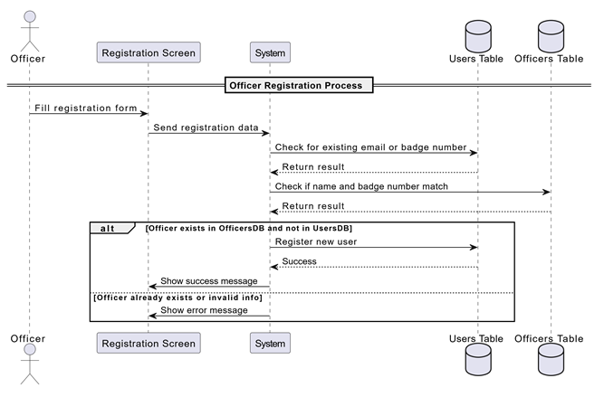

{width="1.21875in"
height="1.1770833333333333in"}{width="1.21875in"
height="1.1770833333333333in"}

[الجمهورية الجزائرية الديمقراطية الشعبية]{dir="rtl"}

Democratic and Popular Algerian Republic

[وزارة التعليم العالي والبحث العلمي]{dir="rtl"}

[]{dir="rtl"}Ministry of Higher Education and Scientific Research

[جـامـعـة الشهيد حمه لخضر الـوادي]{dir="rtl"}

Echahide Hamma Lakhdar University -- El-Oued

Faculty of Exact Sciences [كلية العلوم الدقيقة]{dir="rtl"}

Department of Computer Science [قسم الإعلام الآلي]{dir="rtl"}

**Thesis**

**Presented for the attainment of a license**

**Degree in computer science**

Presented By: Bekkari Haithem

Drihem Abdelmoumen

Theme

**A mobile app for police to track car status**

>  []{dir="rtl"}Presented on \... - \... - 2025
>
> Professor :.................................... MCA President
>
> Professor :.................................... MAA Decided
>
> Professor : Mohammed Amine Yagoub Supervisor

**Academic** Y**ear: 2024/2025**

{width="1.21875in"
height="1.1770833333333333in"}{width="1.21875in"
height="1.1770833333333333in"}

[الجمهورية الجزائرية الديمقراطية الشعبية]{dir="rtl"}

Democratic and Popular Algerian Republic

[وزارة التعليم العالي والبحث العلمي]{dir="rtl"}

[]{dir="rtl"}Ministry of Higher Education and Scientific Research

[جـامـعـة الشهيد حمه لخضر الـوادي]{dir="rtl"}

Echahide Hamma Lakhdar University -- El-Oued

Faculty of Exact Sciences [كلية العلوم الدقيقة]{dir="rtl"}

Department of Computer Science [قسم الإعلام الآلي]{dir="rtl"}

**Thesis**

**Presented for the attainment of a license**

**Degree in computer science**

Presented By: Bekkari Haithem

Drihem Abdelmoumen

Theme

**A mobile app for police to track car status**

> []{dir="rtl"}Presented on \... - \... - 2025
>
> Professor :.................................... MCA President
>
> Professor :.................................... MAA Decided
>
> Professor : Mohammed Amine Yagoub Supervisor

**Academic** Y**ear: 2024/2025**

{width="2.138888888888889in"
height="0.6784722222222223in"}

[أود أن أعبر عن خالص شكري وتقديري لإدارة الكلية وأعضاء هيئة التدريس
الذين قدموا لي المعرفة والإرشاد و البيئة الأكاديمية المناسبة لإعداد هذا
البحث. كما أخص بالشكر مشرفي الأكاديمي]{dir="rtl"}

[الدكتور محمد أمين يعقوب على دعمه المستمر وإرشاداته القيمة.]{dir="rtl"}

[لا يسعني إلا أن أشكر عائلتي العزيزة التي كانت مصدر دعمي وإلهامي خلال
هذه الرحلة، وأصدقائي الذين وقفوا بجانبي دائمًا. كما أشكر كل من ساهم في
إنجاح هذا البحث، سواء بالنصيحة أو المساندة]{dir="rtl"}.

[]{#_Toc196324194 .anchor}

**Summary**

The objective of our final year project, presented in this report, is
the design and development of a mobile application dedicated to the
police for tracking and managing the status of vehicles. This project
aims to address several issues, such as the quick verification of
vehicle information, real-time detection of infractions, and the
optimization of law enforcement interventions.

The application will enable police officers to instantly access
registered vehicle information, report anomalies, and facilitate the
verification of administrative documents. With an intuitive and
user-friendly interface, the application will simplify data management
and enhance the efficiency of police services.

For the design, we used the UML modeling language, while the database
management is handled by a MySQL server.

**Keywords:** Mobile Application, Police, Vehicle Management, Services,
Car Status Tracker, SQL, MySql, Kotlin, Jetpack Compose, Adobe Figma,
Node.js, Express, Render(for api deployment), Clever Cloud, Api.

**[Contents]{dir="rtl"}**

[**Summary** [- 5 -](#_Toc196324194)](#_Toc196324194)

[**1.** **Introduction** [- 11 -](#_Toc194657833)](#_Toc194657833)

[**2.** **The Importance of Police in Taking Security Measures to Reduce
Violations of Vehicle Condition Laws** [- 11
-](#_Toc196324196)](#_Toc196324196)

[**3.** **Role of PolicePlus System for Law Enforcement** [- 12
-](#_Toc196324197)](#_Toc196324197)

[**4.** **How the Police Monitor Vehicle Condition and Detect
Violations** [- 13 -](#_Toc196324198)](#_Toc196324198)

[**1.1 Driver\'s License** [- 13 -](#_Toc194657837)](#_Toc194657837)

[**4.2. Vehicle Registration Certificate** [- 14
-](#_Toc196324200)](#_Toc196324200)

[**4.3 Insurance Certificate** [- 15 -](#_Toc194657839)](#_Toc194657839)

[**4.4 Periodic Technical Inspection** [- 15
-](#_Toc194657840)](#_Toc194657840)

[**4.5 Tax Receipt** [- 16 -](#_Toc194657841)](#_Toc194657841)

[**5.** **Challenges in Police Operations** [- 17
-](#_Toc194657842)](#_Toc194657842)

[**6.** **Conclusion** [- 18 -](#_Toc194657843)](#_Toc194657843)

[**1.** **Introduction** [- 20 -](#_Toc194657844)](#_Toc194657844)

[**2.** **Needs Analysis** [- 20 -](#_Toc194657845)](#_Toc194657845)

[**2.1** **UML Definition:** [- 20 -](#_Toc196324208)](#_Toc196324208)

[**2.2** **UML Modeling for the PolicePlus Mobile App:** [- 20
-](#_Toc196324209)](#_Toc196324209)

[**2.3** **Identification of Actors:** [- 21
-](#_Toc196324210)](#_Toc196324210)

[**2.4** **Use Case Diagrams:** [- 22
-](#_Hlk193281388)](#_Hlk193281388)

[**📌2.4.1 UML Diagrams** []{dir="rtl"}**for Police Officer** [- 22
-](#_Toc194657851)](#_Toc194657851)

[📌**2.4.[2]{dir="rtl"} UML Diagrams []{dir="rtl"}for Car status
management** [- 24 -](#_Hlk193438891)](#_Hlk193438891)

[📌**2.4.3 UML Diagrams []{dir="rtl"}for Accounts management** [- 25
-](#_Toc194657853)](#_Toc194657853)

[📌**2.4.4 UML Diagrams []{dir="rtl"}for Declaration of an accident** [-
28 -](#_Toc194657854)](#_Toc194657854)

[**📌2.4.5 Relationships** [- 30 -](#_Toc194657855)](#_Toc194657855)

[**2.5** **Class Diagram :** [- 31 -](#_Toc196324217)](#_Toc196324217)

[**2.6** **Moving from class schema to databases :** [- 32
-](#_Toc196324218)](#_Toc196324218)

[**2.7** **Data dictionary :** [- 32 -](#_Toc196324225)](#_Toc196324225)

[**3.** **Conclusion** [- 34 -](#_Toc196324226)](#_Toc196324226)

[**1.** **Introduction** [- 36 -](#_Toc196324227)](#_Toc196324227)

[**2.** **Tools Used** [- 36 -](#_Toc196324228)](#_Toc196324228)

[**2.1** **Room database :** [- 36 -](#_Toc196324229)](#_Toc196324229)

[**2.2** **Android Studio :** [- 36 -](#_Toc196324230)](#_Toc196324230)

[**3.** **Programming languages ​​and technologies used** [- 37
-](#_Toc196324231)](#_Toc196324231)

[**3.1** **Kotlin Language :** [- 37 -](#_Toc196324232)](#_Toc196324232)

[**3.2** **Mysql :** [- 37 -](#_Toc196324233)](#_Toc196324233)

[**3.3** **Jetpack Compose :** [- 37 -](#_Toc196324235)](#_Toc196324235)

[**3.4** **Dagger Hilt :** [- 37 -](#_Toc196324237)](#_Toc196324237)

[**3.5** **Retrofit :** [- 38 -](#_Toc196324238)](#_Toc196324238)

[**3.6** **Nodejs :** [- 38 -](#_Toc196324239)](#_Toc196324239)

[**3.7** **Express :** [- 38 -](#_Toc196324240)](#_Toc196324240)

[**3.8** **Render :** [- 38 -](#_Toc196324241)](#_Toc196324241)

[**3.9** **Clever Cloud :** [- 38 -](#_Toc196324242)](#_Toc196324242)

[**3.10** **Postman :** [- 38 -](#_Toc196324243)](#_Toc196324243)

[**3.11** **Figma :** [- 39 -](#_Toc196324244)](#_Toc196324244)

[**3.12** **Git & GitHub :** [- 39 -](#_Toc196324245)](#_Toc196324245)

[**4.** **Summary table** [- 39 -](#_Toc196324246)](#_Toc196324246)

[**5.** **Presentation of the Developed Application** [- 40
-](#_Toc196324247)](#_Toc196324247)

[**5.1** **Scenario:** [- 40 -](#_Toc196324248)](#_Toc196324248)

[**5.2** **Description of the Application Interface:** [- 41
-](#_Toc194657861)](#_Toc194657861)

[**6.** **Conclusion** [- 52 -](#_Toc196324250)](#_Toc196324250)

#  {#section}

#  **List of Figures**  {#list-of-figures}

Figure I.1-Driver
License\...\...\...\...\...\...\...\...\...\...\...\...\...\...\...\...\...\...\...\...\...\...\....\...\...\.....13

Figure I.2- Registration
Certificate\...\...\...\...\...\...\...\...\...\...\...\...\...\...\...\...\...\...\...\...\...\...
14

Figure I.3- Insurance
Certificate\...\...\...\...\...\...\...\...\...\...\...\...\...\...\...\...\...\...\...\...\...\...\....
15

Figure I.4- Technical
Inspection\...\...\...\...\...\...\...\...\...\...\...\...\...\...\...\...\...\...\...\...\...\...\....
16

Figure I.5- Diagram of different possible drivers
violations\...\...\...\...\...\...\...\...\... 17

Figure II.1- Use Case Diagram "Police
Officer"\...\...\...\...\...\...\...\...\...\...\...\...\...\...\... 22

Figure II.2- Sequence Diagram "Police
Officer"\...\...\...\...\...\...\...\...\...\...\...\...\...\...\... 23

Figure II.3- Class Diagram "Police
Officer"\...\...\...\...\...\...\...\...\...\...\...\...\...\...\...\...\....
23

Figure II.4- Use Case Diagram "Car
status"\...\...\...\...\...\...\...\...\...\...\...\...\...\...\...\...\.....
24

Figure II.5- Sequence Diagram "Car
status"\...\...\...\...\...\...\...\...\...\...\...\...\...\...\...\...\.....
24

Figure II.6- Class Diagram "Car status"
\...\...\...\...\...\...\...\...\...\...\...\...\...\...\...\...\...\...\.....
25

Figure II.7- Use Case Diagram "Registration"
\...\...\...\...\...\...\...\...\...\...\...\...\...\...\...\.... 25

Figure II.8- Use Case Diagram "Login"
\...\...\...\...\...\...\...\...\...\...\...\...\...\...\...\...\...\...\.....
26

Figure II.9- Sequence Diagram "Accounts
management"\...\...\...\...\...\...\...\...\...\..... 27

Figure II.10- Class Diagram "Accounts
management"\...\...\...\...\...\...\...\...\...\...\...\.... 27

Figure II.11- Use Case Diagram "Declaration of an
accident"\...\...\...\...\...\...\...\.... 28

Figure II.12- Sequence Diagram "Declaration of an
accident"\...\...\...\...\...\...\...\.... 29

Figure II.13- Class Diagram "Declaration of an
accident"\...\...\...\...\...\...\...\...\...\.... 29

Figure II.14- Class
Diagram\...\...\...\...\...\...\...\...\...\...\...\...\...\...\...\...\...\...\...\...\...\...\...\...\...\...
31

Figure III.1-
Application\...\...\...\...\...\...\...\...\...\...\...\...\...\...\...\...\...\...\...\...\...\...\...\...\...\...\...\...
40

Figure III.2- General Presentation of the Parent
Application\...\...\...\...\...\...\...\...\.... 41

Figure III.3- Police Officer Login & Register
page\...\...\...\...\...\...\...\...\...\...\...\...\...\... 42

Figure III.4- permission to receive
notifications\...\...\...\...\...\...\...\...\...\...\...\...\...\...\.....
43

Figure III.5- Main menu
\'Home\'\...\...\...\...\...\...\...\...\...\...\...\...\...\...\...\...\...\...\...\...\...\...\...\...
44

Figure III.6- Scan
Interface\...\...\...\...\...\...\...\...\...\...\...\...\...\...\...\...\...\...\...\...\...\...\...\...\...\.....
44

Figure III.7- Data
Interface\...\...\...\...\...\...\...\...\...\...\...\...\...\...\...\...\...\...\...\...\...\....\...\...\...\....
45

Figure III.8- History
Interface\...\...\...\...\...\...\...\...\...\...\...\...\...\...\...\...\...\...\...\...\...\...\...\...\....
46

Figure III.9- Profile
Interface\...\...\...\...\...\...\...\...\...\...\...\...\...\...\...\...\...\...\...\...\...\...\...\...\.....
46

Figure III.10- Diagram issue a
ticket\...\...\...\...\...\...\...\...\...\...\...\...\...\...\...\...\...\...\...\...\...\...
47

Figure III.11- Diagram User Login & Register
page\...\...\...\...\...\...\...\...\...\...\...\...\..... 48

Figure III.12- Diagram Home
page\...\...\...\...\...\...\...\...\...\...\...\...\...\...\...\...\...\...\...\...\...\.....
49

Figure III.13- Add new
car\...\...\...\...\...\...\...\...\...\...\...\...\...\...\...\...\...\...\...\...\...\...\...\...\...\...\....
50

Figure III.14- User
Profile\...\...\...\...\...\...\...\...\...\...\...\...\...\...\...\...\...\...\...\...\...\...\...\...\...\...\....
51

Figure III.15- Report a
car\...\...\...\...\...\...\...\...\...\...\...\...\...\...\...\...\...\...\...\...\...\...\...\...\...\...\....
52

**GENERAL INTRODUCTION**

Today, the world is witnessing significant technological advancements in
all sectors, particularly in road safety and vehicle tracking. Modern
technologies now enable law enforcement agencies to use mobile
applications to monitor and manage vehicle status in real time.

Police officers often face numerous challenges, such as quickly
identifying vehicles, verifying documents, and detecting infractions.
Thanks to computing and web services, it is now possible to enhance the
efficiency of these operations by automating the process of vehicle
control and tracking.

In this context, we have been led to design, develop, and implement a
mobile application dedicated to vehicle management by the police. This
application aims to centralize information, provide instant access to
vehicle data, and facilitate officers\' interventions in the field.

Our application is designed to improve vehicle management and optimize
law enforcement operations to enhance the reliability of inspections,
reduce response times, and minimize human errors.

This project consists of three chapters presented as follows:

- The first chapter is dedicated to the theoretical presentation and
  functional requirements.

- Chapter II provides several UML diagrams and specifications.

- Chapter III allows for the visualization and understanding of
  different system interfaces.

Finally, we will conclude this report with a summary of the work
accomplished and an introduction to future perspectives for this
project.

**Section I**

**System Context**

1.  []{#_Toc194657833 .anchor}

2.  **Introduction**

This chapter provides a general overview of the work context and the
objectives of our final year project. We will begin by outlining some of
the challenges faced by law enforcement and the importance of an
information system for police operations.

3.  []{#_Toc196324196 .anchor}**The Importance of Police in Taking
    Security Measures to Reduce Violations of Vehicle Condition Laws**

The police play a crucial role in ensuring road and vehicle safety by
implementing security measures to reduce violations related to vehicle
conditions. Ensuring that vehicles are roadworthy is essential to
prevent accidents caused by mechanical failures or the deterioration of
critical components.

The police conduct regular inspection campaigns to detect vehicles that
do not meet legal standards, such as those with faulty brakes, lighting,
or tires, which may pose risks to drivers and pedestrians. They also
impose fines and penalties on violators to ensure compliance with laws
designed to enhance road safety.

In addition, the police contribute to raising awareness among drivers
about the importance of regular vehicle maintenance through educational
and awareness programs. They also utilize modern technologies, such as
smart cameras and electronic inspection devices, to monitor vehicle
conditions and effectively detect violations.

Thus, the role of the police in enforcing security measures is not
limited to imposing laws but also includes promoting a culture of road
safety awareness, which helps reduce accident rates and ensures a safer
traffic environment for everyone.

4.  []{#_Toc196324197 .anchor}**Role of PolicePlus System for Law
    Enforcement**

A digital system can significantly improve police operations by
offering:

> ➢Automatic license plate recognition and vehicle status tracking.
>
> ➢Quick and efficient vehicle information retrieval.
>
> ➢Secure storage of police records with encryption.
>
> ➢Integration with external databases (e.g., insurance, stolen
> vehicles, tickets).
>
> ➢Real-time data updates and synchronization.
>
> ➢Enhanced communication between police departments and external
> entities.

5.  []{#_Toc196324198 .anchor}**How the Police Monitor Vehicle Condition
    and Detect Violations**

Monitoring the condition of vehicles is a key responsibility of the
police to ensure road safety and reduce accidents. Police officers rely
on a set of documents and standards to determine whether a vehicle
complies with traffic laws. This document highlights five main factors
that help the police monitor vehicle condition and detect potential
violations.

[Files needed to monitor vehicle condition:]{.underline}

[]{#_Toc194657837 .anchor}**1.1 Driver\'s License**

The driver\'s license is an essential document that drivers must carry
while driving. It includes important details such as the license number,
nickname, and name of the driver. The police verify the validity of the
license to ensure that the driver is legally qualified to operate a
vehicle. If the license is expired or invalid, it is considered a
violation.

{width="6.3625in"
height="3.9375in"}

Figure I.1: Driver License

[]{#_Toc196324200 .anchor}**4.2. Vehicle Registration Certificate**

The vehicle registration certificate (also known as the gray card)
proves ownership of the vehicle and contains important information such
as the matriculation. The police check this document to confirm that the
vehicle is legally registered and not stolen. Any discrepancies or
tampering with the information can result in fines.

{width="3.1666666666666665in"
height="2.375in"}

{width="5.75in"
height="3.9375in"}

Figure I.2: Registration Certificate

[]{#_Toc194657839 .anchor}**4.3 Insurance Certificate**

A valid insurance certificate is a legal requirement for drivers. It
includes important details such as the validity period, specified as
\"Valid from Date to Date.\" The police verify the presence of an active
insurance policy, as driving without insurance is a legal violation.
Insurance protects both drivers and pedestrians in the event of an
accident.

{width="2.15625in"
height="1.6041666666666667in"}{width="3.875in"
height="4.135416666666667in"}

Figure I.3: Insurance Certificate

[]{#_Toc194657840 .anchor}**4.4 Periodic** **Technical Inspection**

Laws in many countries require vehicles to undergo regular technical
inspections to ensure their safety and efficiency. The police check for
a valid technical inspection certificate, which includes details such as
the Subsequent Monitoring Date, to confirm that the vehicle meets the
required mechanical and safety standards. Failing to undergo periodic
inspections can result in penalties.

{width="6.3694444444444445in"
height="3.952777777777778in"}

Figure I.4: Technical Inspection

[]{#_Toc194657841 .anchor}**4.5 Tax Receipt**

The tax receipt serves as proof that the necessary vehicle taxes have
been paid. The police verify this document to ensure that the driver
complies with financial regulations related to vehicle ownership.
Failure to pay taxes can lead to fines or even vehicle impoundment.

{width="6.374305555555556in"
height="4.301388888888889in"}

Figure I.5: Diagram of different possible drivers violations

The police rely on these five key documents and standards to maintain
road safety and ensure that all drivers comply with traffic laws. It is
essential for drivers to keep their documents valid and up to date to
avoid violations and penalties.

6.  []{#_Toc194657842 .anchor}**Challenges in Police Operations**

Law enforcement agencies often encounter various difficulties when
managing vehicle-related data, including:

> ➢Difficulty in searching for vehicle records manually.
>
> ➢Time-consuming processes leading to delays in operations.
>
> ➢Risk of document loss or damage in paper-based systems.
>
> ➢Limited storage capacity for physical records.
>
> ➢Inaccurate or outdated record-keeping.
>
> ➢Challenges in statistical analysis and reporting.
>
> ➢Difficulty in accessing real-time vehicle information.
>
> ➢Lack of an efficient system for verifying license plates and
> retrieving related data.

Vehicle inspections are still largely conducted manually, resulting in
reduced efficiency.

Is there a smart solution that simplifies and improves the inspection
process for law enforcement officers?

7.  []{#_Toc194657843 .anchor}**Conclusion**

In this first chapter, we provided an overview of the challenges
associated with manual vehicle inspection. We then focused on
identifying key issues that hinder efficiency and accuracy.

In the next chapter, we will analyze the requirements and explore how
our proposed solution can address these challenges.

**Section II**

**System Design**

### 

### 

### 

### 

### 

### 

### 

### 

### 

### 

1.  []{#_Toc194657844 .anchor}**Introduction**

In this chapter, we present the design of our system. The modeling is
done using UML (Unified Modeling Language).

The main diagrams used are:

- Use Case Diagrams

- Sequence Diagrams

- Class Diagrams

2.  []{#_Toc194657845 .anchor}**Needs Analysis**

    1.  []{#_Toc196324208 .anchor}**UML Definition:**

UML (Unified Modeling Language) is a standard object-oriented modeling
language used to specify, visualize, construct, and document the
components and structure of an information system.

2.  []{#_Toc196324209 .anchor}**UML Modeling for the PolicePlus Mobile
    App:**

In this section, we model the most important features of the
**PolicePlus mobile application**, which is designed to help police
officers track vehicle status using license plate recognition.

We use UML diagrams to:

- Illustrate user interactions with the system

- Describe internal system behavior

- Visualize data flow and database relations

  1.  []{#_Toc196324210 .anchor}**Identification of Actors:**

+----------------------------------------------------------------------+---+
| +:------------------:+:-----------------------------------------:+   |   |
| | **Actor**          | **Role**                                  |   |   |
| +--------------------+-------------------------------------------+   |   |
| | **Police Officer   | \- Register and log in to the app\        |   |   |
| | (App User)**       | - Scan license plates\                    |   |   |
| |                    | - View car status\                        |   |   |
| |                    | - File a ticket\                          |   |   |
| |                    | - Report a stolen car\                    |   |   |
| |                    | - Resume ticket drafts                    |   |   |
| +--------------------+-------------------------------------------+   |   |
| | ####               | \- Populate police database with car and  |   |   |
| | Traffic management | officer records\                          |   |   |
| |                    | - Search and consult car data and         |   |   |
| |                    | violations                                |   |   |
| +--------------------+-------------------------------------------+   |   |
| | **Car Owner**      | \- The system displays data about car     |   |   |
| |                    | owners                                    |   |   |
| +--------------------+-------------------------------------------+   |   |
+======================================================================+===+
+----------------------------------------------------------------------+---+

#### 

[]{#_Hlk193281388 .anchor}

2.  **Use Case Diagrams:**

[]{#_Toc194657851 .anchor}**📌2.4.1 UML Diagrams** []{dir="rtl"}**for**
**Police Officer**

[]{dir="rtl"}**A - Use Case Diagram**

{width="5.930555555555555in"
height="3.3583333333333334in"}

Figure II.1: Use Case Diagram "Police Officer"

This use case diagram shows how a Police Officer interacts with the
system to [authenticate]{.underline} and then [view vehicle
information]{.underline}. After authentication, the officer can access
details such as the [Driver\'s License, Vehicle Registration, Insurance
Certificate, Technical Inspection]{.underline}, and [Tax
Receipt]{.underline} to verify a vehicle's legal status.

**B -** **Sequence Diagram**

{width="4.246527777777778in"
height="3.657638888888889in"}

Figure II.2: Sequence Diagram "Police Officer"

[]{dir="rtl"}**C - []{dir="rtl"}Class Diagram**

{width="2.8847222222222224in"
height="4.253472222222222in"}

Figure II.3: Class Diagram "Police Officer"

[]{#_Hlk193438891 .anchor}📌**2.4.[2]{dir="rtl"} UML Diagrams
[]{dir="rtl"}for Car status management**

[ ]{dir="rtl"}**A - Use Case Diagram**

{width="5.461805555555555in"
height="2.8027777777777776in"}

Figure II.4: Use Case Diagram "Car status"

This use case diagram illustrates how the [Traffic
Management]{.underline} actor interacts with the system to [populate the
police database]{.underline}. Through this main use case, traffic
management can perform tasks such as [adding]{.underline} [new
cars]{.underline}, [searching and consulting car data, viewing
violations]{.underline}, and managing [officer records]{.underline},
ensuring the database remains accurate and up to date.

**B - Sequence Diagram**

{width="4.7340277777777775in"
height="3.040277777777778in"}

Figure II.5: Sequence Diagram "Car status"

**C - []{dir="rtl"}Class Diagram**

{width="6.509722222222222in"
height="3.504166666666667in"}

Figure II.6: Class Diagram "Car status"

[]{#_Toc194657853 .anchor}📌**2.4.3 UML Diagrams []{dir="rtl"}for**
**Accounts management**

**A - Use Case Diagram**

{width="6.491666666666666in"
height="1.9895833333333333in"}

Figure II.7: Use Case Diagram "Registration"

This use case diagram represents the Officer Registration Process. The
[Officer]{.underline} starts the registration, which triggers a [Check
for Existing]{.underline} [Record]{.underline} process. This process
includes [Validating Officer Details]{.underline} to ensure correctness.
If the record [already exists or is invalid]{.underline}, an [Error
Message]{.underline} is shown. If the record is [valid and
new]{.underline}, the system proceeds to [Register the
Officer]{.underline} successfully.

{width="5.270833333333333in"
height="2.125in"}

Figure II.8: Use Case Diagram "Login"

This use case diagram represents the Officer Login Process. The
[Officer]{.underline} initiates the [Start Login]{.underline} process,
which includes [Validating Credentials]{.underline} to ensure
authentication. If the credentials are correct, a [Success
Message]{.underline} is displayed. If they are incorrect, an [Error
Message]{.underline} is shown.

**B - Sequence Diagram**

{width="6.588888888888889in"
height="4.497916666666667in"}

Figure II.9: Sequence Diagram "Accounts management"

**C - []{dir="rtl"}Class Diagram**

{width="4.381944444444445in"
height="3.0208333333333335in"}

Figure II.10: Class Diagram "Accounts management"

[]{#_Toc194657854 .anchor}📌**2.4.4 UML Diagrams []{dir="rtl"}for
Declaration of an accident**

**A - Use Case Diagram**

{width="6.0in"
height="2.3854166666666665in"}

Figure II.11: Use Case Diagram "Declaration of an accident"

The diagram shows that police officers can file a ticket, resume a
draft, or submit it. Car owners can report a stolen vehicle.

**B - Sequence Diagram**

\-**Stolen Car**

{width="6.0875in"
height="3.207638888888889in"}

**-Ticket Filing**

{width="6.0875in"
height="4.832638888888889in"}

Figure II.12: Sequence Diagram "Declaration of an accident"

**C - []{dir="rtl"}Class Diagram**

{width="6.115972222222222in"
height="2.464583333333333in"}

Figure II.13: Class Diagram "Declaration of an accident"

[]{#_Toc194657855 .anchor}**📌2.4.5 Relationships**

Police Database:

• users: Contains information about officer users of the application
such as email, password, name, rank, department, and badge number.\
• officers: Includes names and badge numbers of real officers, used for
identity verification during registration.\
• normal_users: Represents regular users (e.g., drivers), including
name, email, password, and driver\'s license number.\
• cars: Includes vehicle data such as make and model, color, license
plate, owner name, driver license, inspection start/end dates, tax
payment status, and stolen status.\
• tickets: Represents traffic tickets issued by officers to drivers.

Insurance Database:

• Insurance: Contains insurance information related to vehicles,
including license plate, owner name, insurance start and end dates.

🔗 Relationships:

• Each vehicle in the Police Database is matched with the Insurance
Database using the **license_plate**.\
• A user who issues tickets must be a verified officer by matching their
**name and badge number** with the officers table.\
• A user of type \"officer\" can issue multiple tickets (One-to-Many:
users → tickets).\
• Each ticket is linked to a regular user (driver) through the
**driver's license** (Many-to-One: tickets → normal_users).\
• Vehicles can be associated with regular users through the **driver
license** field.\
• A regular user can report a stolen vehicle by providing their
**driver's license** and the stolen status (Yes/No), which updates the
stolen_car field in the cars table.\
• Each vehicle can have one associated insurance record (One-to-One:
cars → Insurance).

3.  []{#_Toc196324217 .anchor}**Class Diagram :**

{width="6.451388888888889in"
height="6.883333333333334in"}

Figure II.14: Class Diagram

4.  []{#_Toc196324218 .anchor}**Moving from class schema to databases
    :** []{dir="rtl"}

> users([id]{.underline}, email, password, name, rank, department,
> badge_number, cars_scanned, officer_image, created_at)
>
> tickets([ticket_id]{.underline}, driver_license, ticket_type,
> ticket_details, issued_by_badge, issued_by_name, issue_date,#
> driver_license, #issued_by_badge)
>
> officers([id]{.underline}, name, badge_number)
>
> normal_users([id]{.underline}, name, email, password, license_number,
> created_at)
>
> cars([id]{.underline}, license_plate, owner_name, inspection_start,
> inspection_end, tax_paid, stolen_car, make_and_model, color,
> driver_license, address, #license_number)
>
> Insurance(id, licence_plate, owner, insurance_start, insurance_end,
> #licence_plate)

5.  []{#_Toc196324225 .anchor}**Data dictionary :**

  --------------- ---------------- ------------------ ------------- --------------------
  **Category**    **Element**      **Coding**         **Data type** **Value**

  []{dir="rtl"}   ID               id                 Int           PK
  **User**                                                          

                  Email            email              VARCHAR       255

                  Password         password           VARCHAR       255

                  Name             name               VARCHAR       100

                  Rank             rank               VARCHAR       50

                  Department       department         VARCHAR       100

                  Badge Number     badge_number       VARCHAR       50 (nullable, UNI)

                  Cars Scanned     cars_scanned       Int           default 0, nullable

                  Officer Image    officer_image      TEXT          Nullable

                  Created At       created_at         timestamp     CURRENT_TIMESTAMP

  **Ticket**      ID               ticket_id          Int           PK

                  Driver License   driver_license     VARCHAR       50 (FK to
                                                                    normal_users)

                  Ticket Type      ticket_type        VARCHAR       50

                  Ticket Details   ticket_details     TEXT          Nullable

                  Badge Number     issued_by_badge    VARCHAR       50 (FK to users)

                  Officer Name     issued_by_name     VARCHAR       100

                  Issue Date       issue_date         timestamp     default
                                                                    CURRENT_TIMESTAMP,
                                                                    nullable

  **Officer**     ID               id                 Int           PK

                  Name             name               VARCHAR       100, nullable

                  Badge Number     badge_number       VARCHAR       50, nullable

  **User (normal  ID               id                 Int           PK
  users)**                                                          

                  Name             name               VARCHAR       100

                  Email            email              VARCHAR       255 (UNI)

                  Password         password           VARCHAR       255

                  License Number   license_number     VARCHAR       50, nullable

                  Created At       created_at         timestamp     CURRENT_TIMESTAMP

  **Car**         ID               id                 Int           PK

                  License Plate    license_plate      VARCHAR       20

                  Owner Name       owner_name         VARCHAR       100, nullable

                  Inspection Start inspection_start   DATE          Nullable

                  Inspection End   inspection_end     DATE          Nullable

                  Tax Paid         tax_paid           VARCHAR       10, nullable

                  Stolen Car       stolen_car         VARCHAR       10, nullable

                  Make and Model   make_and_model     VARCHAR       100, nullable

                  Color            color              VARCHAR       50, nullable

                  Driver License   driver_license     VARCHAR       50, nullable

                  Address          address            VARCHAR       255, nullable

  **Insurance**   ID               id                 Int           PK

                  License Plate    licence_plate      VARCHAR       20 (UNI, FK to cars)

                  Owner            owner              VARCHAR       100

                  Insurance Start  insurance_start    DATE          

                  Insurance End    insurance_end      DATE          
  --------------- ---------------- ------------------ ------------- --------------------

3.  []{#_Toc196324226 .anchor}**Conclusion**

This chapter allowed us to present the approach followed to address the
problem in question, whether through the description of the system
hierarchy or the diagrams outlining the structure of the app. However,
the practical implementation still remains --- which will be the focus
of the next chapter.

**Section I****II**

**System Implementation**

1.  []{#_Toc196324227 .anchor}**Introduction**

In this chapter, we will discuss the tools and specific programming
languages used in the development and implementation of the website. We
will also present the graphical interfaces of this application.

2.  []{#_Toc196324228 .anchor}**Tools Used**

    1.  []{#_Toc196324229 .anchor}**Room database :**

Room is a persistence library introduced as part of the Android Jetpack
suite to simplify working with SQLite databases. It provides:

- A structured approach to manage data.

- Compile-time checks for SQL queries.

- Seamless integration with modern Android components like LiveData and
  Coroutines. \[1\]

  1.  []{#_Toc196324230 .anchor}**Android Studio :**

Android Studio is the official Integrated Development Environment (IDE)
for Android app development. Based on the powerful code editor and
developer tools from IntelliJ IDEA , Android Studio offers even more
features that enhance your productivity when building Android apps, such
as:

- A flexible Gradle-based build system

- A fast and feature-rich emulator

- A unified environment where you can develop for all Android devices

- Live Edit to update composables in emulators and physical devices in
  real time

- Code templates and GitHub integration to help you build common app
  features and import sample code

- Extensive testing tools and frameworks. \[2\]

3.  []{#_Toc196324231 .anchor}**Programming languages ​​and technologies
    used**

    1.  []{#_Toc196324232 .anchor}**Kotlin Language :**

Kotlin is an open-source, statically-typed programming language that
supports both object-oriented and functional programming. Kotlin
provides similar syntax and concepts from other languages, including C#,
Java, and Scala, among many others. Kotlin does not aim to be unique,
instead, it draws inspiration from decades of language development. It
exists in variants that target the JVM (Kotlin/JVM), JavaScript
(Kotlin/JS), and native code (Kotlin/Native). \[3\]

2.  []{#_Toc196324233 .anchor}**Mysql :**

> \"SQL\", the acronym for Structured Query Language. A relational
> database organizes data into one or more data tables in which data may
> be related to each other; these relations help structure the data. SQL
> is a language that programmers use to create, modify and extract data
> from the relational database, as well as control user access to the
> database. In addition to relational databases and SQL, an RDBMS like
> MySQL works with an operating system to implement a relational
> database in a computer\'s storage system, manages users, allows for
> network access and facilitates testing database integrity and creation
> of backups. \[4\]

3.  []{#_Toc196324235 .anchor}**Jetpack Compose :**

> Jetpack Compose is Android's recommended modern toolkit for building
> native UI. It simplifies and accelerates UI development on Android.
> Quickly bring your app to life with less code, powerful tools, and
> intuitive Kotlin APIs. \[5\]

4.  []{#_Toc196324237 .anchor}**Dagger Hilt :**

> Dagger Hilt is a dependency injection library for Android, built on
> top of Dagger 2. Hilt is designed to simplify the implementation of
> dependency injection in Android apps by reducing boilerplate code and
> providing seamless integration with Android components such as
> activities, fragments, services, and ViewModels. It leverages the
> power of Dagger under the hood while offering a more concise and
> intuitive API for developers. \[6\]

5.  []{#_Toc196324238 .anchor}**Retrofit :**

> Retrofit is a type-safe HTTP client for Android and Java, library that
> simplifies this process by providing a clean and efficient way to make
> API calls. \[7\]

6.  []{#_Toc196324239 .anchor}**Nodejs :**

> Node.js is an open-source and cross-platform JavaScript runtime
> environment. It is a popular tool for almost any kind of project!
>
> Node.js runs the V8 JavaScript engine, the core of Google Chrome,
> outside of the browser. This allows Node.js to be very performant.
>
> \[8\]

7.  []{#_Toc196324240 .anchor}**Express :**

> Express is an open-source web application framework for Node.js. It
> provides a robust set of features for building web and mobile
> applications, including routing, middleware, template engines,
> seamless database integration, and a wealth of features for developing
> advanced features and functions. \[9\]

8.  []{#_Toc196324241 .anchor}**Render :**

> Render is a cloud-based platform that simplifies the process of
> deploying and hosting web applicatoins, APIs, static sites, and more.
> It automates tasks like building, deploying, and scaling applications,
> making it easier for us to bring our project to production.\[10\]

9.  []{#_Toc196324242 .anchor}**Clever Cloud :**

> Clever Cloud provides an automated hosting platform for developers.
> Deploy your app easily and launch dependencies without having to worry
> about the infrastructure set up. Follow this guide to get ready to
> deploy quickly as you learn the basics of Clever Cloud. \[11\]

10. []{#_Toc196324243 .anchor}**Postman :**

> Postman is an all-in-one API platform for building and working with
> APIs. It takes the pain out of every stage of the API lifecycle---from
> designing and testing to delivery and monitoring. Built for teams,
> Postman makes it easy to collaborate, stay organized, and build
> secure, reliable APIs faster. \[12\]

11. []{#_Toc196324244 .anchor}**Figma :**

> Figma is a collaborative web application for interface design, with
> additional offline features enabled by desktop applications
> for macOS and Windows. The feature set of Figma focuses on user
> interface and user experience design. \[13\]

12. []{#_Toc196324245 .anchor}**Git & GitHub :**

> Git is a version control system that intelligently tracks changes in
> files. Git is particularly useful when you and a group of people are
> all making changes to the same files at the same time.
>
> GitHub is a cloud-based platform where you can store, share, and work
> together with others to write code. \[14\]

4.  []{#_Toc196324246 .anchor}**Summary table**

  --------------------- -------------------------------------------------
      **Component**                    **Technology Used**

       Mobile App                    Kotlin, Jetpack Compose

      Backend APIs               JavaScript (Node.js + Express)

        Database                              MySQL

      UI/UX Design                         Adobe Figma

       Deployment            Render (APIs), Clever Cloud (Databases)

   Local Data Storage               Room (Android SQLite ORM)

  Dependency Injection                     Dagger Hilt

  Network Communication                  Retrofit, Axios

        Security              Bcrypt (password hashing), JWT (token
                                         authentication)

          IDEs                 Android Studio, Visual Studio Code

     Version Control                       Git, GitHub

       API Testing                           Postman
  --------------------- -------------------------------------------------

5.  []{#_Toc196324247 .anchor}**Presentation of the Developed
    Application**

Before starting the development, it was necessary to prepare the
essential tools. After familiarizing ourselves with the development
environment, we first integrated the necessary libraries and then
defined the usage scenario of the application. The different stages are
described below:

1.  []{#_Toc196324248 .anchor}**Scenario:**

Our application is designed for police officers to facilitate the
management and tracking of vehicles. It allows officers to quickly
access vehicle information by scanning or entering a license plate
number.

The application is connected to a centralized database where vehicle
information is stored, including the registration certificate, the
owner\'s driver\'s license, insurance details, technical inspection
status, and road tax payment.

With this application, law enforcement can verify the administrative
status of vehicles in real time, detect potential violations, and
optimize their field interventions. The application requires an internet
connection to query the remote database and ensure real-time updates of
information.

Figure III.1: Application

2.  []{#_Toc194657861 .anchor}**Description of the Application
    Interface:**

In the following, we present the different interfaces of the
application, detailing each screenshot.

Figure III.2: General Presentation of the Parent Application

[The application provides two login options []{dir="rtl"}either \'Police
Officer\' or \'User\':]{.underline}

[]{dir="rtl"}To begin, the []{dir="rtl"}officer is required to enter a
\'Username\' and \'Password\' when launching the application. If no
account exists, registration must be completed by providing a Badge
Number, Rank, Department, and Email address.

{width="1.6805555555555556in"
height="3.7041666666666666in"}{width="1.6666666666666667in"
height="3.6868055555555554in"}

Figure III.3: Police Officer Login & Register page

a.  **«Main» Interface:**

> This is the main interface. It is displayed after verifying the
> \'Username\' and \'Password\' and shows the user\'s activities. A
> message will appear asking for permission to receive notifications
> from the application. The interface allows the user to choose from the
> options: \'Home,\' \'Data,\' \'Scan,\' \'History,\' and \'Profile\'.
>
> {width="1.5506944444444444in"
> height="3.3243055555555556in"}

Figure III.4: permission to receive notifications

b.  **«Home» Interface:**

> Use the search bar for quick vehicle lookups by entering the vehicle
> number and clicking \'Search\' to display the vehicle\'s details.
> Additionally, the last three scanned cars and the total number of
> scanned cars are displayed.

[]{dir="rtl"}Figure III.5: Main menu \'Home\'

c.  **«Scan» Interface:**

> License Plate Recognition and Data Retrieval: The officer can scan the
> vehicle number and confirm the scanned details.
>
> {width="1.761111111111111in"
> height="3.8222222222222224in"}{width="1.761111111111111in"
> height="3.81875in"}

Figure III.6: Scan Interface

d.  **«Data» Interface:**

> Here, all information is displayed, including owner details, insurance
> start and end dates, stolen vehicle status, and any unpaid tickets.

{width="1.725in"
height="3.821527777777778in"}

{width="1.7291666666666667in"
height="3.821527777777778in"}

Figure III.7: Data Interface

e.  **«History» Interface:**

> The app allows officers to view previous scans with full details and
> filter records by selecting \'Stolen,\' \'Issue,\' or \'All.

{width="1.8027777777777778in"
height="4.020138888888889in"}
{width="1.8118055555555554in"
height="4.040972222222222in"}

Figure III.8: History Interface

f.  **«Profile» Interface:**

> The officer can view account information and log out when needed.
>
> {width="1.7590277777777779in"
> height="3.9166666666666665in"}{width="1.7708333333333333in"
> height="3.9166666666666665in"}

Figure III.9: Profile Interface

g.  **Ticket** **Interface:**

> The officer can issue a ticket.
>
> {width="1.8416666666666666in"
> height="4.094444444444444in"}{width="1.882638888888889in"
> height="4.094444444444444in"}
>
> {width="1.8541666666666667in"
> height="4.138888888888889in"}{width="1.8618055555555555in"
> height="4.1402777777777775in"}

Figure III.10: issue a ticket

[]{dir="rtl"}Alternatively, the user must enter their Email and
Password. If they do not already have an account, they will need to
register by providing their Name, Email address, Password, and Car
License Plate.

> {width="1.8958333333333333in"
> height="4.21875in"}{width="1.90625in"
> height="4.229166666666667in"}
>
> []{dir="rtl"}

Figure III.11: User Login & Register page

h.  **«Main» Interface[\"]{dir="rtl"} User[\"]{dir="rtl"}:**

> The main interface appears after verifying the user information. It
> displays user activities and prompts for notification permissions.
> Users can navigate to: Home []{dir="rtl"}and Profile.

i.  **«Home» Interface[\"]{dir="rtl"} User[\"]{dir="rtl"}:**

> All car details are displayed here, including the owner, model, color,
> driving license, and registration information such as insurance,
> inspection, car registration, and tax.

{width="1.7708333333333333in"
height="3.910416666666667in"}{width="1.7395833333333333in"
height="3.8541666666666665in"}

Figure III.12: Home page

j.  **Add new car Interface :**

> To add a new car, click the button and enter the license plate number.
>
> {width="1.6875in"
> height="3.78125in"}{width="1.6875in"
> height="3.7604166666666665in"}
>
> {width="1.7083333333333333in"
> height="3.8229166666666665in"}
>
> {width="1.7083333333333333in"
> height="3.8125in"}

Figure III.13: Add new car

k.  **User profile :**

> The Profile page displays the user\'s account information, including
> their name, email address, and driver\'s license details.
>
> {width="1.6708333333333334in"
> height="3.7083333333333335in"}{width="1.6770833333333333in"
> height="3.7395833333333335in"}

Figure III.14: User Profile

l.  **Report a car**

> The user can report a vehicle by providing the following
> []{dir="rtl"}information:

- License Number

- Indicate if the vehicle is stolen (Yes/No)

- Additional details (optional)\
  Then, click submit report.

> {width="1.7291666666666667in"
> height="3.8333333333333335in"}{width="1.7083333333333333in"
> height="3.8125in"}

Figure III.15: Report a car

6.  []{#_Toc196324250 .anchor}**Conclusion**

> In this chapter, we presented the development environment and the main
> interfaces of our police application. These interfaces offer all the
> necessary features for police officers and other users to manage tasks
> efficiently, such as vehicle tracking, reporting, and accessing
> important information.
>
> **General conclusion**
>
> This project focuses on tracking vehicle statuses and assisting police
> officers in verifying vehicle-related information.
>
> We have developed an application that enables law enforcement to
> efficiently access and manage vehicle data in real time.
>
> The application allows police officers to check essential vehicle
> documents, including the registration certificate, driver\'s license,
> insurance details, technical inspection status, and tax receipts. It
> also facilitates quick identification of anomalies, such as stolen
> vehicles or expired documents. Additionally, officers can receive
> alerts and take immediate action when necessary.
>
> For the development of our application, we used Android Studio, Adobe
> Figma, and MySQL.
>
> We also plan to enhance the system with offline functionality and more
> security measures to improve efficiency and reliability.

**List of sources and references**

\[1\] : [Room Database in
Android(medium.com)](https://medium.com/@anandgaur2207/room-database-in-android-d5f279d4648a)

\[2\] : [Meet Android
Studio(developer.android.com)** **](https://developer.android.com/studio/intro)

\[3\] : [Kotlin
overview(developer.android.com)](https://developer.android.com/kotlin/overview)

\[4\] : [MySQL(wikipedia)](https://en.wikipedia.org/wiki/MySQL)

\[5\] : [Jetpack
Compose(developer.android.com)](https://developer.android.com/compose)

\[6\] : [Understanding Dagger Hilt: Simplified Dependency Injection for
Android(medium.com)](https://medium.com/@jecky999/understanding-dagger-hilt-simplified-dependency-injection-for-android-5bce6ad66e03)

\[7\] : [Retrofit in
Android(medium.com)](https://medium.com/@KaushalVasava/retrofit-in-android-5a28c8e988ce)

\[8\] : [Introduction to
Node.js(nodejs.org)](https://nodejs.org/en/learn/getting-started/introduction-to-nodejs)

\[9\] : [What is Express.js?
(medium.com)](https://medium.com/@Brilworks/what-is-express-js-a-comprehensive-guide-to-beginners-b289a25bd414)

\[10\] : [Slow
rendering(developer.android.com)](https://developer.android.com/topic/performance/vitals/render)

\[11\] : [Clever
cloud(clever-cloud.com)](https://www.clever-cloud.com/developers/doc/quickstart/)

\[12\] : [What is
Postman?(postman.com)](https://www.postman.com/product/what-is-postman/)

\[13\] : [Figma(wikipedia)](https://en.wikipedia.org/wiki/Figma)

\[14\] : [About GitHub and Git
(docs.github.com)](https://docs.github.com/en/get-started/start-your-journey/about-github-and-git)

[\
](https://medium.com/@KaushalVasava?source=post_page---byline--5a28c8e988ce---------------------------------------)

[\
](https://medium.com/@anandgaur2207?source=post_page---byline--d5f279d4648a---------------------------------------)
